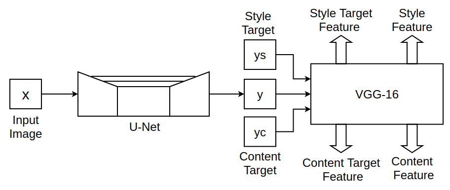
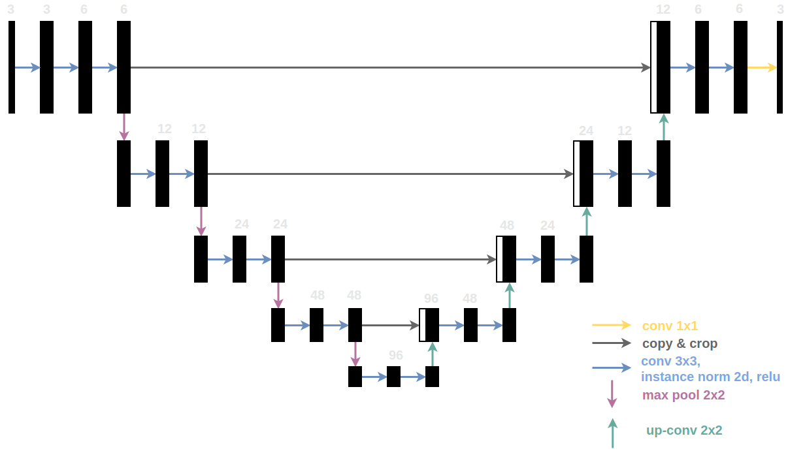
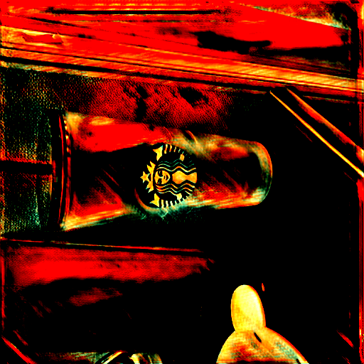
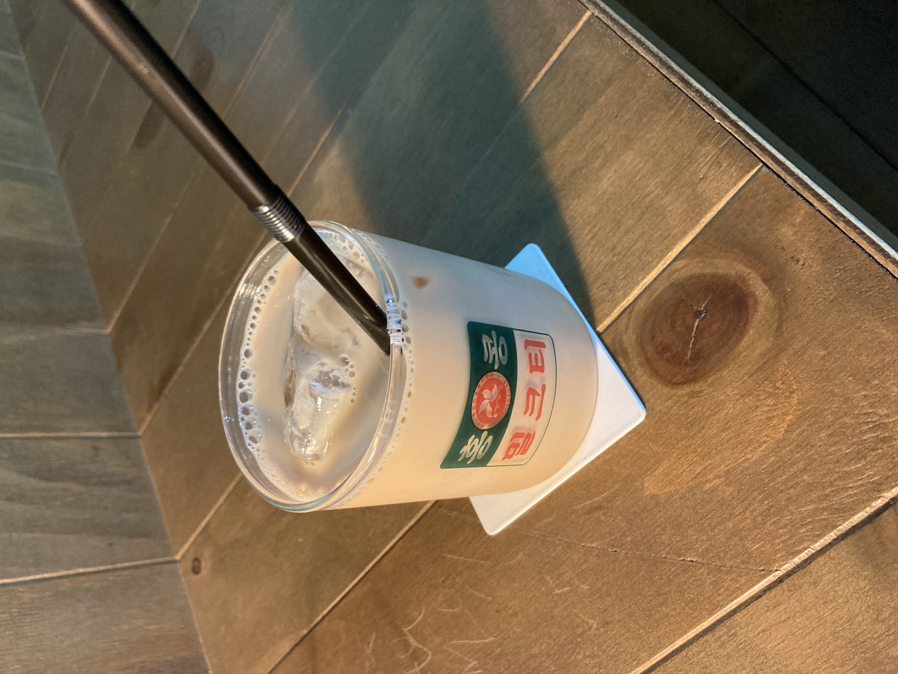
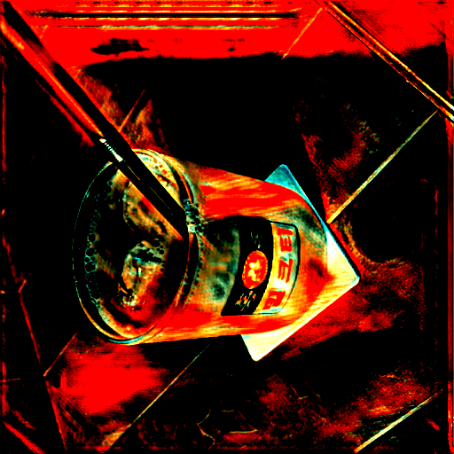

## CLASS : IntroductionOfAI   Term Project : Style Transfer using UNet

### Style Transfer

from 'Image Style Transfer Using Convolutional Neural Networks'

### Architecture

### U-Net

### Output

  to 

  to 

